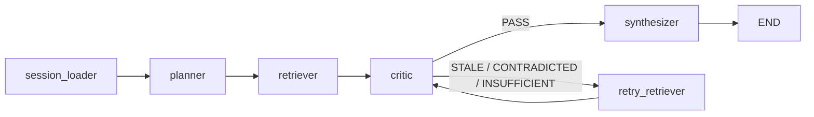

# RECON — Research Navigator

**Multi-agent ML literature research with temporal reasoning.**

Most RAG systems treat retrieval as a similarity problem. RECON treats it as an evidence quality problem. There's a difference: a 2019 paper with 800 citations is strong evidence for what the field *believed* in 2019. If a 2023 paper explicitly supersedes it, that same chunk is now weak evidence — regardless of its cosine score. Standard RAG has no way to detect this. RECON does.

> 🔬 **Live demo above** — try a query like *"What is the current state of KV cache compression in LLMs?"*

---

## How it works

RECON runs a four-agent pipeline on every query:

```
session_loader → planner → retriever → critic → synthesizer
                                           ↓
                               [STALE / CONTRADICTED / INSUFFICIENT]
                                     retry_retriever → critic
                                         (up to 2 retries)
```

**Planner** — breaks the query into temporally-typed sub-questions: foundational (what's established), recent (what's changed), and contested (what's still debated).

**Retriever** — hits Semantic Scholar's live index (200M+ papers) and DuckDuckGo, then scores results using recency-weighted hybrid scoring. Three decay configs available: none, linear, log.

**Critic** — the core of the system. Issues one of four verdicts per retrieval pass:
- `PASS` — evidence is recent, sufficient, no contradictions
- `STALE` — retrieved papers have been superseded by more recent work
- `CONTRADICTED` — claims conflict across retrieved sources
- `INSUFFICIENT` — not enough high-quality evidence to synthesize

The critic combines deterministic threshold routing with an LLM-assisted contradiction check. STALE, INSUFFICIENT, and PASS verdicts are assigned based on hardcoded thresholds (mean paper age, minimum result count, score cutoffs). CONTRADICTED is determined by calling Groq with a structured pairwise prompt that returns a `{"contradicts": bool, "reason": "..."}` JSON verdict — a canonical LLM-as-a-Judge pattern applied to contradiction detection specifically.

If the critic issues anything other than PASS, the retriever tries again with a refined query (max 2 retries). This retry loop is what drives the staleness catch rate improvement.

**Synthesizer** — produces a structured research position: overview, key findings, active debates, and a per-claim confidence table with source attribution.

---

## Eval results

Evaluated on a 130-question ground truth dataset across three categories: consensus claims (Category A), superseded claims (Category B), and contested claims (Category C). Ground truth was sourced from real survey paper abstracts — not synthetic.

| Architecture | Position Accuracy | Staleness Catch Rate | Avg Latency |
|---|---|---|---|
| Single-agent RAG | 32.3% | 0% | 4.8s |
| Naive multi-agent | 44.6% | 0% | 23.9s |
| RECON (no decay) | 47.7% | 42% | 21.8s |
| **RECON (linear decay)** | **43.9%** | **52%** | **17.1s** |
| RECON (log decay) | 43.1% | 38% | 15.9s |

**Linear decay was selected as optimal** — highest staleness catch rate (52%) at reasonable latency. The position accuracy tradeoff vs. no-decay (43.9% vs 47.7%) is acceptable given the staleness detection gain is the primary goal.

**On the calibration anomaly:** STALE-verdict queries achieve *higher* position accuracy than PASS-verdict queries. This is explainable: the retry loop, triggered by a STALE verdict, fetches fresher evidence — resulting in a better final answer than a first-pass PASS on borderline evidence.

**Known limitation:** Contradiction catch rate is 0% in the current system. The STALE check fires before the CONTRADICTED check in the critic, so contradictions are frequently reclassified as staleness. This is documented as future work — fixing it requires either reordering the verdict logic (which risks false positives) or a separate contradiction scorer at eval time.

---

## Architecture diagram



---

## Superseded claims reference dataset

As part of building the eval, 43 ML claims were catalogued across four subfields (LLM efficiency, training methods, RAG, multimodal) where newer survey papers document explicit supersession. This dataset was used to construct Category B of the eval and seed the staleness detection ground truth.

This is a **reference dataset used in evaluation** — not auto-generated from live queries. Once the Space accumulates real user traffic, the `verdict_log` table in session memory will power a live leaderboard generated from actual pipeline verdicts.

---

## Tech stack

| Component | Choice |
|---|---|
| Orchestration | LangGraph |
| LLM | Groq / LLaMA 3.3-70B-versatile |
| Primary retrieval | Semantic Scholar REST API (direct, no library) |
| Fallback retrieval | DuckDuckGo (`ddgs`) + Tavily |
| Embeddings | `all-MiniLM-L6-v2` |
| Session memory | SQLite |
| Eval | LLM-assisted contradiction detection (Groq structured prompt) + custom staleness catch rate metric |
| UI | Gradio 6.10 |

One deliberate choice worth noting: the `semanticscholar` PyPI library was explicitly avoided due to a pagination hang bug on large result sets. All S2 calls go through direct `requests.get()` to `graph/v1/paper/search`.

---

## Repo

[github.com/MukulRay1603/project-recon](https://github.com/MukulRay1603/project-recon)

Built as a portfolio project — MS Applied ML, UMD College Park.